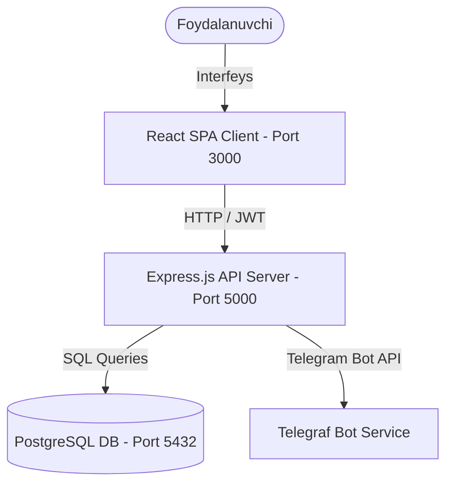

# Black Door ERP — Tizim Arxitekturasi (System Design)

Ushbu hujjat **Black Door ERP** tizimining arxitekturasini, ma'lumotlar oqimini hamda Telegram 2FA tasdiqlash jarayonini batafsil tushuntiradi.

---

## 1. Umumiy Arxitektura (High-Level Architecture)

Tizim uchta asosiy qismdan iborat bo'lgan **Client-Server** arxitekturasiga asoslangan:

1. **Frontend (React Client):** Nginx veb-serveri yordamida `3000` portda ishlaydi. Foydalanuvchi interfeysi Neumorphic (Soft UI) uslubida qurilgan bo'lib, barcha API so'rovlarni Axios interseptori orqali shifrlangan holda yuboradi.
2. **Backend (Node.js API):** Express.js yordamida `5000` portda ishlaydi. Biznes logikalar, autentifikatsiya, balans hisob-kitoblari va ombor operatsiyalari shu yerda bajariladi.
3. **Database (PostgreSQL 14):** `5432` portda barcha relatsion ma'lumotlarni saqlaydi va tranzaksiya yaxlitligini ta'minlaydi.

---

## 2. 2FA Xavfsizlik Va Ulanish Protokoli

Tizimda foydalanuvchilar sessiyalari o'ta yuqori xavfsizlik darajasida himoyalangan. Google OAuth login jarayonidan so'ng **Telegram 2FA** faollashadi.

### 2FA Oqimi (Data Flow):

1. **Google Login:** Foydalanuvchi tizimga Google orqali login qilganda backend unga 15 daqiqalik cheklangan `tempToken` tokenini qaytaradi.
2. **Bot Ulanishi:** Foydalanuvchiga Telegram botga kirish deep-link havolasi ko'rsatiladi:
   `https://t.me/blackdoor_2fa_bot?start=TOKEN_UUID`
3. **Bot /start buyrug'i:** Foydalanuvchi botda `/start` bosganida:
   - Bot token UUID yordamida foydalanuvchining ID sini topadi.
   - Foydalanuvchining Telegram ID va Username'ini `users` jadvaliga biriktiradi.
   - Tasodifiy 6 xonali kod yaratib, uni `verification_tokens` jadvaliga yozadi va foydalanuvchiga yuboradi.
4. **Veb-panelda Kod Kiritish:** Foydalanuvchi 6 xonali kodni veb-panelga kiritgach, backend uni tekshiradi va haqiqiy `accessToken` hamda `refreshToken` taqdim etadi.

---

## 3. Moliya Va Balans Hisoblash Mexanizmi (Bookkeeping Engine)

Moliya bo'limi tizimning eng maxfiy qismi hisoblanadi. Tranzaksiya oqimi balans hisob-kitoblari bilan qattiq bog'langan:

- **Income (Kirim):** `cash_deposit`, `product_sale`, `factory_rental`, `factory_commission` kabi tranzaksiyalar yaratilganda, bog'liq hamkor/shaxs balansiga summa **qo'shiladi**.
- **Expense (Chiqim):** `personal_withdrawal`, `product_purchase`, `domestic_payment`, `foreign_payment` tranzaksiyalarida bog'liq hisobdan summa **ayriladi**.
- **Rollback (Bekor qilish):** Tranzaksiya o'chirilganda/bekor qilinganda, backend bazadagi balans o'zgarishini avtomatik ravishda qarama-qarshi summaga o'zgartirib tiklaydi.
