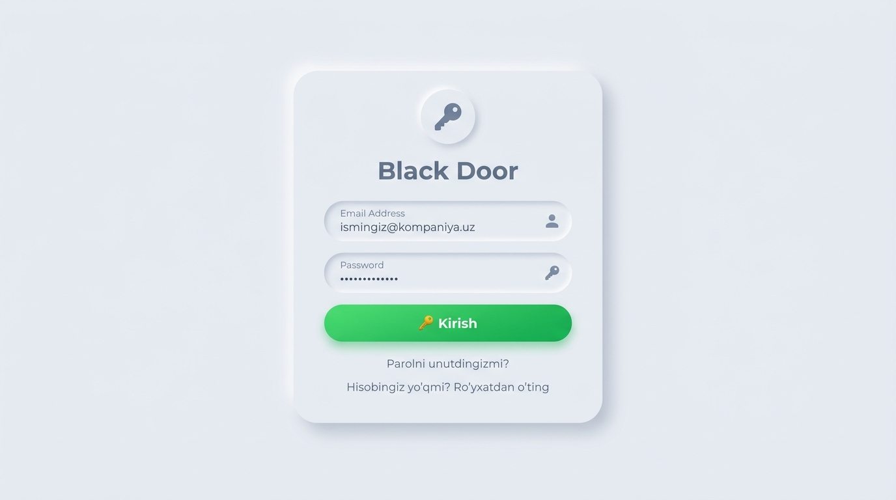
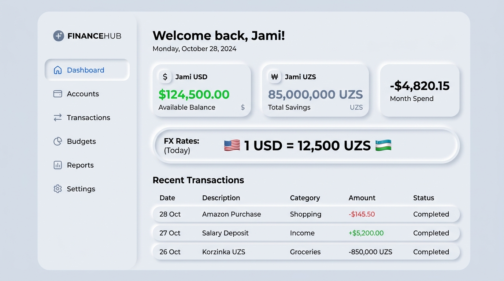
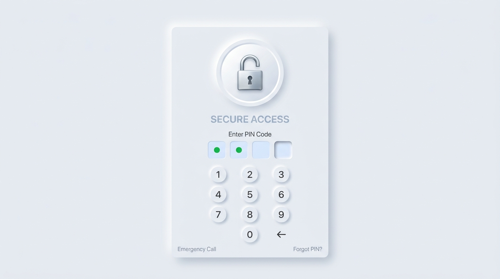

# Black Door — Enterprise Financial Management System

**Black Door** — bu ko'p obyektli korxonalar (zavodlar, qurilish maydonlari, omborlar) uchun mo'ljallangan moliyaviy buxgalteriya va operatsion boshqaruv tizimi (ERP). Tizim interfeysi zamonaviy **Neumorphism (Soft UI / yumshoq skeuomorfizm)** uslubiga ega.

---

## 🎨 Yangi Dizayn: Neumorphism (Soft UI)

Tizimning barcha sahifalari och rangli, silikon/plastik yuzadan bo'rtib chiqqan yoki unga botirilgan elementlar uslubida qayta ishlandi:
* **Yagona Fon:** Tizim bo'ylab sovuq oq-kulrang fon (`#EEF2F7`) ishlatilgan.
* **Soyalar orqali Ajratish:** Elementlar fondan faqat yumshoq ikki tomonlama soyalar (chap-yuqoridan oq va o'ng-pastdan kulrang) yordamida ajralib turadi.
* **Tugmalar:** Bo'rtgan (extruded) tugmalar bosilganda silliq animatsiya bilan botgan (pressed/inset) holatga o'tadi.
* **Inputlar:** Barcha matn kiritish maydonlari va select menyulari botgan (inset) shaklga keltirilgan.
* **Aksentlar:** Ortiqcha ranglar butunlay olib tashlanib, ijobiy balans va summalar uchun **yumshoq yashil**, salbiy/xavfli amallar uchun **marjon-qizil** ranglar tanlangan.
* **Shrift:** Tizimdagi yagona shrift sifatida zamonaviy va doiraviy shaklga ega **Nunito** shrifti o'rnatildi.

---

## 📸 Dastur Interfeysidan Namunalar (UI Mockups)

Quyida tizimning yangilangan Neumorphic sahifalaridan namunalar va ularning afzalliklari keltirilgan:

### 1. Tizimga Kirish Sahifasi (Login Page)
Yumshoq fonga ega bo'lgan sodda va minimalistik kirish sahifasi. Karta yuza ustida suzib turgandek ko'rinadi, inputlar esa botgan holatda bo'lib foydalanuvchiga e'tiborni qaratishda yordam beradi.


### 2. Moliyaviy Boshqaruv Paneli (Financial Dashboard)
Hisobot kartalari, yon menyu (sidebar) va valyuta kursini aks ettiruvchi inset capsule displey. Har bir element ranglar orqali emas, yumshoq soyalar yordamida nafis ajratilgan.


### 3. PIN-kod Himoya Oynasi (PIN Lockscreen)
Seyf metaforasi o'rniga doiraviy tugmachalardan iborat Neumorphic klaviatura va botgan PIN-kod indikatorlari o'rnatildi. PIN xato kiritilganda klaviatura qizil tus oladi va titraydi.


---

## 🚀 Tizim Imkoniyatlari va Funksionallik

Tizimda 4 ta asosiy foydalanuvchi roli mavjud va har bir rol uchun alohida boshqaruv panellari (Dashboard) va ruxsatnomalar ajratilgan:

### 1. Foydalanuvchilar va Obyektlar Boshqaruvi (Super Admin)
* **Xodimlar boshqaruvi:** Yangi foydalanuvchilar yaratish, ularni faollashtirish/bloklash va rollarini belgilash.
* **Obyektlar reyestri:** Korxonaga qarashli ishlab chiqarish obyekti, qurilish yoki omborlarni qo'shish va ularga menejerlarni biriktirish.
* **Valyuta Kursi:** Markazlashtirilgan joriy kursni boshqarish (1 USD = ? UZS).
* **Audit Jurnali:** Tizimdagi har bir muhim amalni (tranzaksiyalar, o'zgarishlar, o'chirishlar) vaqt va foydalanuvchi kesimida jurnalga qayd etish.

### 2. Moliya va Xazina moduli (Finansist & Admin)
* **Kassalar:** USD va UZS balanslariga ega bo'lgan bir nechta xazina va kassa hisobvaraqlarini yuritish.
* **Kirim-Chiqim Tranzaksiyalari:** Tranzaksiya toifalarini belgilash, turlarini (kirim, chiqim, o'tkazma, valyuta ayirboshlash) ko'rsatgan holda hisob-kitob qilish.
* **Kontragentlar va Qarzlar:** Hamkorlar (kontragentlar) bilan hisob-kitoblar tarixi hamda qarzlar reyestri (outstanding debt).
* **Moliya PIN verification:** Maxfiy "Qora daftar" (moliya bo'limi)ga kirish uchun maxsus 4 xonali PIN kodli himoya tizimi o'rnatilgan.

### 3. Obyekt va Xodimlar Boshqaruvi (Menejer)
* **Mini-Kassa:** Menejer o'ziga biriktirilgan obyekt uchun ajratilgan kassa balansini boshqaradi.
* **Xodimlar ro'yxati:** Obyektda faoliyat yurituvchi ishchilar ro'yxati va ularning faollik holati.
* **Ish haqi to'lovlari:** Ishchilarga tizim orqali maosh to'lash va ularni kassa balansidan ayirish.

### 4. Ombor va Materiallar Nazorati (Omborchi / Menejer)
* **Mahsulotlar:** Ombor zaxirasidagi tovarlar va materiallar ro'yxati.
* **Ombor Harakatlari (Movements):** Obyektlararo tovarlarni qabul qilish yoki boshqa obyektga jo'natish tranzaksiyalari.
* **Inventarizatsiya (Stock Check):** Tizimdagi qoldiqlar bilan amaldagi tovarlarni solishtirish va tafovutlarni to'g'rilash.

### 5. Tahliliy Hisobotlar (Reports)
* Davriy filtrlar yordamida quyidagi hisobotlarni generatsiya qilish:
  - Kirim-chiqim hisoboti (balans o'zgarishlari);
  - Kassalar qoldiqlari balansi;
  - Qarzlar va kontragentlar balansi;
  - Kategoriyalar bo'yicha moliyaviy tahlil.
* Natijalarni **Excel** yoki **PDF** formatlarida eksport qilish imkoniyati.

---

## 🛠️ Texnologiyalar (Tech Stack)

* **Backend:** PHP 8.2+ / Laravel 11
* **Frontend:** HTML5, Vanilla CSS3 (Neumorphic Custom Design), Alpine.js (interaktiv komponentlar uchun)
* **Database:** SQLite (lokal/test jarayonida) yoki PostgreSQL/MySQL (production uchun)
* **Reporting Service:** Python 3.10+ (PDF/Excel hisobot generatori mikroxizmati sifatida)

---

## 💻 Loyihani O'rnatish va Ishga Tushirish

### 1. Tizim talablari:
* PHP >= 8.2
* Composer
* SQLite3
* Python >= 3.10 (PDF/Excel hisobotlari ishlashi uchun)

### 2. Loyihani yuklab olish va paketlarni o'rnatish:
```bash
# Composer orqali PHP kutubxonalarini yuklash
composer install

# Environment konfiguratsiyasini sozlash
copy .env.example .env

# App key generatsiya qilish
php artisan key:generate
```

### 3. Ma'lumotlar bazasini sozlash va migratsiyalarni yuritish:
`.env` faylida SQLite bazasi yo'lini ko'rsating yoki sukut bo'yicha SQLite bazasini yarating:
```bash
# Bo'sh SQLite faylini yaratish (Windows PowerShell)
New-Item -Path database/database.sqlite -ItemType File -Force

# Migratsiyalar va demo ma'lumotlarni yozish
php artisan migrate:fresh --seed
```

### 4. Hisobot berish xizmatini yoqish (Python):
```bash
cd services/reports
pip install -r requirements.txt
python main.py
```
*Bu xizmat sukut bo'yicha `http://127.0.0.1:8000` portida ishga tushadi.*

### 5. Web-serverni ishga tushirish:
```bash
# Laravel serverini yoqish
php artisan serve
```
Tizimga brauzer orqali `http://127.0.0.1:8000` manzilida kiring.

### 6. Testlarni ishga tushirish:
Tizimning barcha ruxsatnomalari va moliyaviy balans amallari to'g'ri ishlayotganligini tekshirish uchun testlarni ishga tushiring:
```bash
php artisan test
```

---
*Loyihaning Neumorphic (Soft UI) dizayni to'liq yakunlandi va foydalanishga tayyor.*
